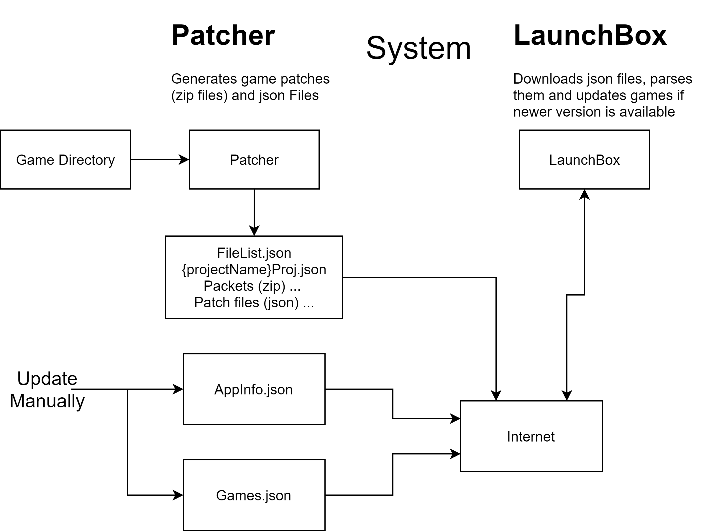
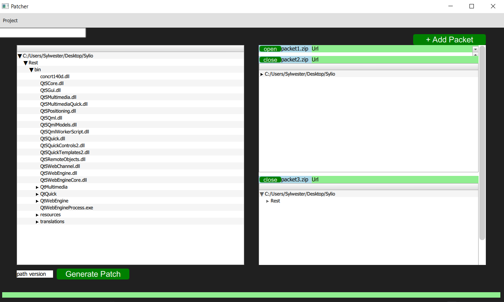
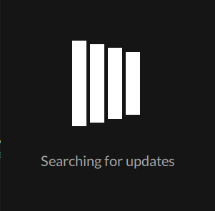
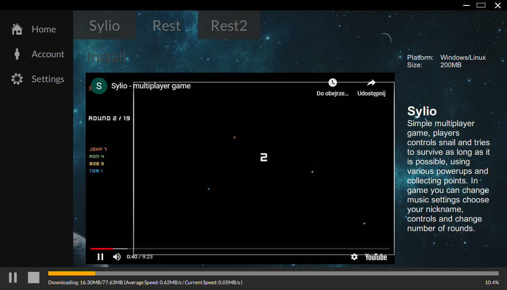

# LaunchBox
LaunchBox is free game launcher, you can use this code and modify for your project. Main problems are solved such as version checking, reading your game web page, showing tips, etc. LaunchBox is written in qt/c++. Currenty system works only on windows i will port it on Linux asap
# Overview
System contains two main programs: Patcher and LaunchBox. Patcher is developer tool for generating game patches. (zip packets, json files). LaunchBox is client program, that allows to install your game, update, uninstall, autoupdate wchen never verion is available. Witch patcher you can split your game files into several packets (zip files). I suggest you to separate library/game engine files, assets, executable files. When newer version is available LaunchBox dowloads packets which contains modified/new files and unpack them to game directory. LauchBox also can delete files that are not neede any more. You dont need any server to comute delta between current client game version and actual, everything is computed on client side in LaunchBox. You only need some space on the internet where you can store game files, it can be ftp or http server, there are many free options. But links to fils must be valid all the time, you cannot change links to files. Update System uses json files which stores information about your game, some of them are generated by Patcher but rest of them needs to be writed manually.
# How does it work
 
## Patcher
Open new project -> chose game directory, project directory, project name, gameName. On the right side you can create new packets, change their names etc. On the left side you can see actual state of game directory. Now just open packet and drag folders/files from left window to packet window. When u are done press generate to create files. When u need to create patch just insted of creating new project open existing one {name}.json file. Patcher is in early development (i focused on developing LaunchBox) so if something goes wrong exit and start over i will fix bugs asap. When Game directory changes just mofify path in Project file. I suggest you to make copies of generated files, dont lose them aspecially project file.
### Patcher



Patcher generates 4 components:
1. fileList.json - json file that contains all information about current game directory: files, sizes, hashes, directories etc. After generation manually add urls to your packets http or ftp link (redirections are accepted)
```javascript
{
"AppName": "LaunchBox",
    "Files": {
        "bin": {
            "Id": "0",
            "Sha": "",
            "Size": "0"
        },
        "bin/LaunchBox.exe": {
            "Id": "0",
            "Sha": "35fc22fb9ffed5519493a154807eb9f2e8952be1108ea1870bb7723efe223604",
            "Size": "6836736"
        },
        .
        .
        .
    },
    "Packets": {
      "0": {
        "Name": "packet1.zip",
        "Size": "81398406",
        "Url": "paste here link to this package"
      }
    },
    "Ver": "1.0"
}
```
2. {projName}.json - Porject file is contains information about last patch directory status it is almost copy of fileList.json with several additional informations. When you want to create next patch, open this file in Patcher, comparation between current state of game directory and information in this file are used to calculate wchich files was changed/deleted or added.
```javascript
{
 "AppComponents": {
        "packet1.zip": {
            "Files": {
                "bin": {
                    "LaunchBox.exe": {
                        "Sha": "35fc22fb9ffed5519493a154807eb9f2e8952be1108ea1870bb7723efe223604",
                        "Size": "6836736"
                    },
                    .
                    .
                    .
            "Size": "---",
            "Url": "---"
        },
        .
        .
        .
    },
    "AppDir": "C:/Users/Sylwester/Desktop/LaunchBox/DesktopAplication/out/install/x64-Release/LaunchBox",
    "AppName": "LaunchBox",
    "ProjectDir": "C:/Users/Sylwester/Desktop/LaunchBoxProject",
    "ProjectName": "LaunchBox",
    "Ver": "1.0"
}
```
3. game packets - zip files with compressed files from your game directory.
4. patch files - json files with information about delta between current and last state (last patch) of game directory. It contains three main infrmation which files was changed, added and deleted.
```javascript
{
    "AddedFiles": [
        "Nowy folder/Nowy folder",
        "Nowy folder",
        "Nowy folder/asdasd.txt"
    ],
    "AppName": "Sylio",
    "ChangedFiles": [
    ],
    "RemovedFiles": [
    ],
    "Ver": "1.2"
}
```

System  uses also two files that muse be edited manually
* AppInfo.json - Contains main information about game such as current version, link to fileList, and patch files. Update current version of game and add link to new patch file in Versioning section
```javascript
{
  "AppName": "Sylio",
  "Ver": "1.2",
  "FileList": "FileList link",
  "Versioning": {
    "1.2": "link to first patch file",
    "1.1": "link to second patch file",
    "1.0": "link to third patch file"
  }
}
```
* Games.json - file that contains intofmation about all your games published in LaunchBox
```javascript
{
  "Sylio": {
    "Id": "1",
    "Ver": "1.0",
    "GameExecPath": "./Release/Sylio.exe",
    "PresentationUrl": "https://youtube.pl",
    "PresentationQml": "",
    "PresentationPackUrl": "",
    "PresentationVer": "1.0",
    "AppInfoUrl": "https://onedrive.live.com/download?cid=607F7FD0AF3C1C7E&resid=607F7FD0AF3C1C7E%211893&authkey=AL4amoGidXqM504"
  },
  "Rest": {
    "Id": "2",
    "Ver": "1.0",
    "GameExecPath": "./Release/Sylio.exe",
    "PresentationUrl": "",
    "PresentationQml": "ExampleOne.qml",
    "PresentationPackUrl": "https://onedrive.live.com/download?cid=607F7FD0AF3C1C7E&resid=607F7FD0AF3C1C7E%211884&authkey=ANDR-ZRgV4fY078",
    "PresentationVer": "2.0",
    "AppInfoUrl": "https://onedrive.live.com/download?cid=607F7FD0AF3C1C7E&resid=607F7FD0AF3C1C7E%211893&authkey=AL4amoGidXqM504"
  },
  "Rest2": {
    "Id": "3",
    "Ver": "1.0",
    "GameExecPath": "./Release/Sylio.exe",
    "PresentationUrl": "",
    "PresentationQml": "ExampleOne.qml",
    "PresentationPackUrl": "https://onedrive.live.com/download?cid=607F7FD0AF3C1C7E&resid=607F7FD0AF3C1C7E%211884&authkey=ANDR-ZRgV4fY078",
    "PresentationVer": "1.0",
    "AppInfoUrl": "https://onedrive.live.com/download?cid=607F7FD0AF3C1C7E&resid=607F7FD0AF3C1C7E%211893&authkey=AL4amoGidXqM504"
  }
}
```


Now upload files on the internet, remember to have always valid links

## LaunchBox
Becouse LaunchBox is self updating it contains 3 programs:
* Updater - program thah updates LaunchBox and Game pages if needed
* LaunchBox - main program
* Launcher small program (on Windows is written in C#) that first runs Updater and after its exection LauchBox
### Updater

### LaunchBox

### Updating Details

## Options
### If you want to deploy your game witch LaunchBox you have 3 options
#### Clone reposotory and modify code. 
It was my first Project witch qml so code is spaghetti. I used Qt framework with Curl
# Libraries
## Curl - use conan to install
## QT - path in qt paths
